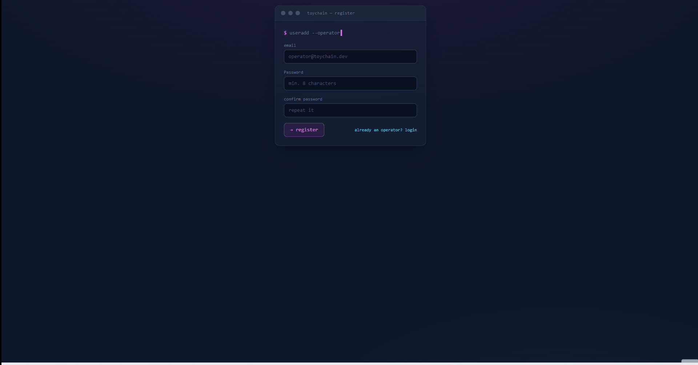
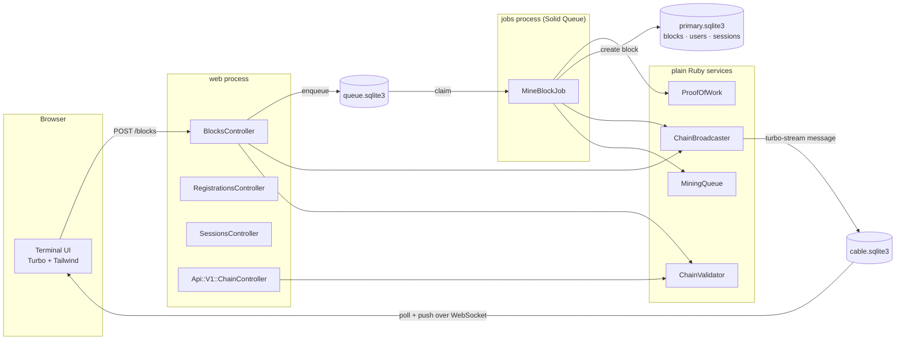
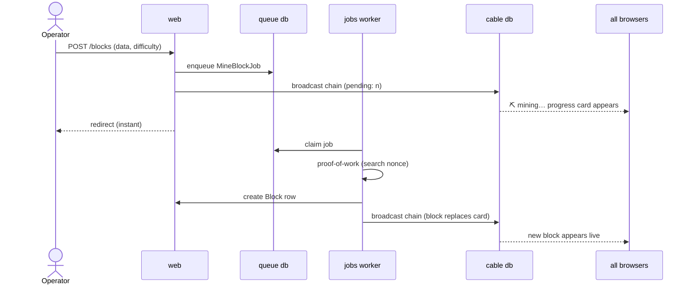

# ⛓ toychain

Educational blockchain built with Ruby on Rails — SHA-256 proof-of-work,
background mining with live progress, authenticated operators, and visual
tamper detection.

> Register, mine blocks, tamper with them, and watch integrity break in
> cascade — live, in every connected browser.



## What it demonstrates

- **Proof-of-work**: each block is mined by brute-forcing a nonce until its
  SHA-256 hash meets a difficulty target of 2–6 leading zeros, selectable per
  block. Each block records how long its mining took (`mined in … ms`), making
  the exponential cost of each extra zero visible in real data.
- **Chain integrity**: the validator checks three things per block — the
  **link** (previous hash matches), the **integrity** (stored hash verifies
  against the block's own data) and the **work** (the hash meets the
  difficulty the block claims), so under-mined blocks can't sneak in.
- **Tamper detection**: the `☠ tamper` button modifies a block's data without
  re-mining — exactly what an attacker editing the database would do. The
  validator catches it instantly and every connected browser sees the
  corruption cascade in real time. Tampering is attributed: the block records
  *who* corrupted it.
- **Accountability**: every block records the operator who mined it
  (`mined by`), and tamper actions are signed into the data — the chain is
  not just verifiable but attributable.

## Architecture



Three processes in development (`bin/dev`): web server, Tailwind watcher and
the Solid Queue worker — the same shape as production. Three SQLite databases:
primary (domain), queue (jobs) and cable (realtime messages). Cross-process
realtime works because broadcasts travel *through the database*, not through
process memory.

## Mining lifecycle



While a job mines, every subscribed browser shows an animated terminal-style
progress card; when proof-of-work completes, the broadcast replaces it with
the real block. No polling, no page reloads, no custom JavaScript.

## Authentication

Everything is behind login: visiting any page as an anonymous user redirects
to `/session/new`, and new operators can self-register at `/registration/new`.
Built on the Rails 8 authentication generator: `has_secure_password` (bcrypt),
database-backed sessions (revocable — each login is a row), and an
`Authentication` concern enforcing `require_authentication` app-wide.

The Action Cable connection is authenticated too (`connection.rb` rejects
sockets without a valid session cookie) — realtime updates are a
logged-in-only capability by construction, not by CSS.

## JSON API

`GET /api/v1/chain` authenticates with **Bearer tokens** (create yours at
`/api_tokens` — only the SHA-256 digest is stored, the raw token is shown
once). It returns the full chain plus its verdict:

```json
{
  "valid": true,
  "first_invalid": null,
  "length": 3,
  "pending": 0,
  "blocks": [ { "index": 1, "data": "genesis", "hash": "0000…",
                "mined_by": "operator@toychain.dev", "...": "…" } ]
}
```

```bash
curl -H "Authorization: Bearer tc_…" https://…/api/v1/chain
```

### External verification

`scripts/verify_chain.py` re-validates the whole chain **independently** —
recomputing every SHA-256, link and difficulty check in ~60 lines of
dependency-free Python, and comparing its verdict with the server's:

```bash
TOYCHAIN_TOKEN=tc_… python3 scripts/verify_chain.py http://localhost:3000
```

Don't trust, verify: if the server ever lied about validity, the script
would catch the disagreement.

## Security details worth noting

- Strong parameters everywhere; hashes, nonce and index are always computed
  server-side (mass assignment mitigated).
- Difficulty is **clamped server-side to 2–6** and validated at the model —
  a tampered form can't enqueue hour-long mining jobs (DoS via user input).
- Passwords hashed with **bcrypt** via `has_secure_password` (72-byte input
  cap surfaced in the UI). Sessions are DB rows: revocable, auditable.
- State-mutating actions use POST/DELETE with CSRF tokens, never GET.
- WebSocket connections require an authenticated session — anonymous clients
  can't even subscribe to the stream.
- CI runs Brakeman, RuboCop and the full test suite on every push.

## Running it

    bin/setup
    bin/dev          # web + Tailwind watcher + Solid Queue worker
    bin/rails test

Register your operator at `/registration/new` and start mining.

## Roadmap

- [x] Per-block author (`mined_by`) — blocks signed by the operator who
      queued them
- [x] API tokens for header-based auth (`Authorization: Bearer …`)
- [x] External verifier script (Python) re-validating independently
- [ ] Difficulty statistics view — mined_ms vs difficulty scatter, the
      exponential curve from real data
- [ ] Deploy with Kamal on a VPS (SSL, multi-process, SQLite in production)

## Stack

Rails 8 · Ruby 3.4 · SQLite ×3 · Solid Queue · Solid Cable · Turbo Streams ·
Tailwind CSS 4 · bcrypt · Minitest

## License

MIT © Zoel Manchón
